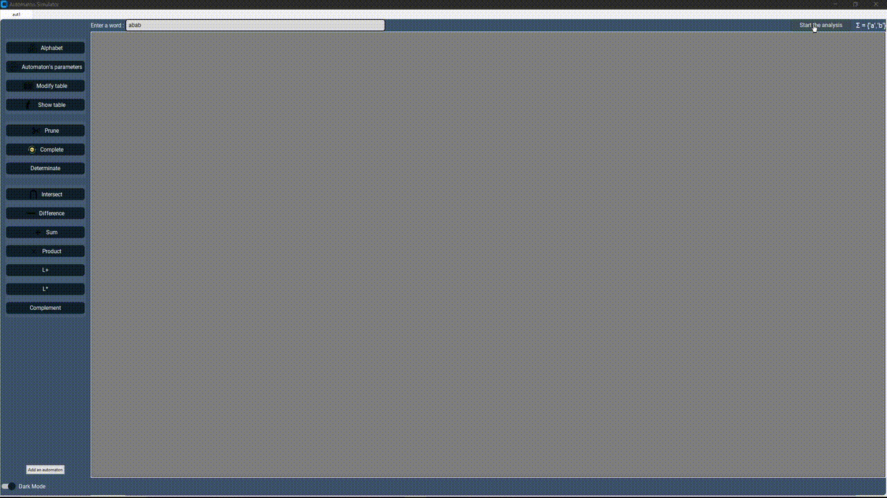
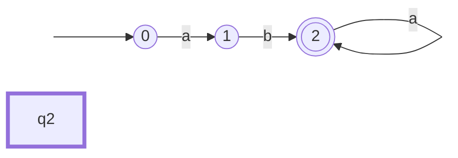

<h1 align="center"> GUI Automaton Simulator </h1>
<h3 align="center"> Semester 6 - Formal Language Theory </h3>
<h5 align="center"> Project Assignment - <a href="https://www.univ-jfc.fr/">Champollion University</a> (January-March 2024) </h5>

    

<!-- TABLE OF CONTENTS -->
<h2 id="table-of-contents"> :book: Table of Contents </h2>

    
Table of Contents

<ol>
    <li><a href="#about-the-project"> ➤ About The Project</a></li>
    <li><a href="#overview"> ➤ Overview</a></li>
    <li><a href="#setup"> ➤ Installation and Setup</a></li>
    <li><a href="#features"> ➤ Features</a></li>
    <li><a href="#usage"> ➤ How to Use the Simulator?</a></li>
    <li><a href="#examples"> ➤ Basic Examples</a></li>
    <li><a href="#acknowledgments"> ➤ Acknowledgments</a></li>
</ol>

<!-- ABOUT THE PROJECT -->
<h2 id="about-the-project"> :pencil: About The Project</h2>

    This project is a <strong>Finite Automaton Simulator</strong> with a graphical user interface, developed in Python 3 as part of a course on <strong>Formal Language Theory</strong>. The simulator supports both <strong>Deterministic Finite Automata (DFA)</strong> and <strong>Nondeterministic Finite Automata (NFA)</strong>, two key models in automata theory.

<h3>What is a Finite Automaton?</h3>

    In computer science, a <strong>finite automaton</strong> (or <strong>finite state machine</strong>) is a mathematical model used to represent systems that have a finite number of possible states. Finite automata are fundamental in pattern recognition, lexical analysis, and parsing, where they are used to recognize sequences of symbols that match specific rules.

There are two primary types of finite automata:

<ol>
    <li>
        <strong>Deterministic Finite Automaton (DFA):</strong>
        

            In a DFA, for each state and input symbol, there is exactly one transition to another state. This predictability makes DFAs simpler to understand and implement but also limits their flexibility. DFAs are often used in applications like lexical analyzers in compilers, where each input leads deterministically to a single next state.
        

    </li>
    <li>
        <strong>Nondeterministic Finite Automaton (NFA):</strong>
        

            In an NFA, for each state and input symbol, there can be multiple possible transitions, or even none. This non-determinism allows NFAs to be more flexible in representing complex patterns, though they can be harder to simulate directly. Despite this, any NFA can be converted into an equivalent DFA, making both models equally powerful in terms of the languages they can recognize.
        

    </li>
</ol>

<!-- OVERVIEW -->
<h2 id="overview"> :cloud: Overview</h2>

    This simulator allows users to <strong>create, visualize, and test both DFAs and NFAs</strong>. Through the graphical interface, users can define states, transitions, and inputs for either type of automaton and simulate their behavior with specific input sequences. The simulator visually demonstrates how an input sequence navigates through the automaton's states and indicates whether it reaches an accepting state (a successful match).

    I developed this project with the intention of creating a tool that I could reuse and expand upon in the future. To achieve this, I went beyond the course requirements to build a powerful, user-friendly simulator that makes exploring automata theory engaging and accessible. This tool combines enhanced functionality and a flexible design, allowing for deeper experimentation with DFAs, NFAs, and pattern recognition within strings.

<!-- OVERVIEW -->
<h2 id="setup"> :computer: Installation and Setup</h2>

This project was developed and tested using the following environment. Using these versions ensures the GUI scaling and automaton logic perform as expected.

<table>
  <tr>
    <th>Dependency</th>
    <th>Recommended Version</th>
  </tr>
  <tr>
    <td>Python</td>
    <td>3.13+</td>
  </tr>
  <tr>
    <td>CustomTkinter</td>
    <td>5.2.2+</td>
  </tr>
  <tr>
    <td>Pillow (PIL)</td>
    <td>12.1.0+</td>
  </tr>
</table>

<b>1. Quick Install Command</b>

<pre><code>pip install customtkinter>=5.2.2 pillow>=12.1.0</code></pre>

<b>2. Run the Project</b>

Clone the repository and run the main script:

<pre><code>git clone https://github.com/SteelPoathor/GUI-Automaton-Simulator.git
cd GUI-Automaton-Simulator
python3 Simulator.py</code></pre>

<!-- OVERVIEW -->
<h2 id="features"> :small_red_triangle_down: Features</h2>

<ul>
    <li><strong>Full Automata Logic:</strong> Support for Deterministic (DFA) and Nondeterministic (NFA) automata, including <b>ε-transitions</b>.</li>
    <li><strong>Advanced Operations:</strong> 
        <ul>
            <li><b>Transformation:</b> Pruning, Completion, and Determinization.</li>
            <li><b>Set Operations:</b> Intersection, Difference, Sum (Union), and Product of multiple automata.</li>
            <li><strong>Kleene Logic:</strong> Compute L+ and L* (Kleene Star) of any language.</li>
        </ul>
    </li>
    <li><strong>Visual Tape Reading:</strong> A real-time animation showing how the "Reading Head" moves across the input word.</li>
    <li><strong>Tabbed Interface:</strong> Manage multiple automata simultaneously using an integrated notebook system.</li>
    <li><strong>Modern UI/UX:</strong> Built with <code>CustomTkinter</code>, featuring a <b>Dark/Light mode</b> switch for comfortable viewing.</li>
</ul>

<!-- OVERVIEW -->
<h2 id="usage"> :question: How to Use the Simulator?</h2>

<ol>
    <li><strong>Define Alphabet:</strong> Use the <b>"Alphabet"</b> button to add symbols (e.g., <code>a, b, c, d</code>).</li>
    <li><strong>Initialize:</strong> Click <b>"Automaton's parameters"</b> to set the number of states and identify which are initial or accepting.</li>
    <li><strong>Configure Transitions:</strong> Click <b>"Modify table"</b> to open the transition grid. Enter the target states for each alphabet symbol (use 'epsilon' for NFA transitions).</li>
    <li><strong>Simulate:</strong> Enter a word in the top bar and click <b>"Start the analysis"</b>. The canvas will animate the state transitions.</li>
    <li><strong>Transform:</strong> Use the sidebar buttons (<b>Determinate</b>, <b>Prune</b>, etc.) to modify the current automaton instantly.</li>
</ol>
    <li>
        <b>Multi-Automata Operations:</b> You can work with multiple structures simultaneously to build complex logic:
        <ul>
            <li>Click the <b>"Add an automaton"</b> button to initialize a new, independent workspace.</li>
            <li>Once you have multiple automata, use the <b>Operations</b> buttons (such as <b>Union</b>, <b>Intersection</b>, <b>Difference</b>, or <b>Product</b>) to merge them.</li>
            <li>The simulator will automatically generate a new resulting automaton, calculating all <b>ε-transitions</b> and state mappings for you.</li>
        </ul>
    </li>

<!-- OVERVIEW -->
<h2 id="examples"> :crystal_ball: Basic Examples</h2>

This example demonstrates a basic 3-state automaton over the alphabet `{a, b}`.

### 1. Basic Configuration
1.  **Define Alphabet**: Click the **Alphabet** button and add `a` and `b`.
2.  **Set State Logic**: Click **Automaton's parameters** and configure:
    *   **Number of states**: 3
    *   **Initial State**: Select `0`
    *   **Final State**: Select `2`

### 2. Filling the Transition Table
Click the **Modify table** button. This table defines how the machine moves between states. Enter the targets as shown below:

| State | Input **a** | Input **b** |
|:--- |:--- |:--- |
| **0** (Start) | `1` |  |
| **1** |  | `2` |
| **2** (End) | `2` |  |

*(Note: A space ` ` means no transition exists for that symbol.)*

### 3. Visual Schema
Once configured, your logic will follow this flow:
### Logic Schema

<!-- OVERVIEW -->
<h2 id="acknowledgments"> :mega: Acknowledgments</h2>

<ul>
    <li><strong>Thorgrimm</strong> for taking care of the entire graphical interface, making the simulator user-friendly and visually appealing.</li>
    <li><strong>Professor Thierry Montaut</strong> for providing valuable guidance and insights during the Formal Language Theory course, helping to shape and refine the project.</li>
    <li><strong>Myself</strong> for handling the algorithmic part of the automata, ensuring that the core functionality of DFA and NFA simulations works smoothly.</li>
</ul>

